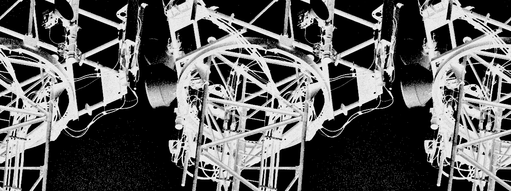

Hi, I'm Oliver. 

I'm a physics undergrad at Durham. I'm mostly interested in machine learning, statistical mechanics, and network protocols. I'm proficient in Go and Python.

Besides that, I spend a lot of time mountain biking, messing with my car, snowboarding, taking photos, and trying to learn a bit of Japanese.

Please check out my projects below! You can also check out my site [oli.mcinnes.cc](https://oli.mcinnes.cc) or email me at [oli@mcinnes.cc](mailto://oli@mcinnes.cc).
